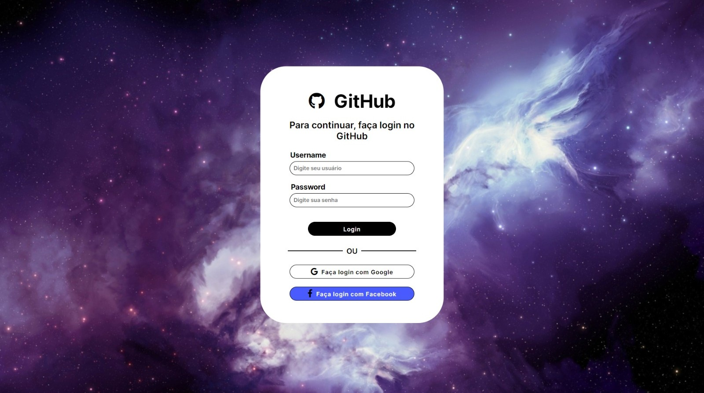

# Skeleton

|      MOBILE         |          DESKTOP       |
|:-------------------:|:-----------------------:
|||
|                     |                        |

[Clique aqui](https://ma7hs.github.iologin-page/) para acessar o site!
---
## Sobre 

- Projeto de uma interface de login utilizando o framework Skeleton.

- O objetivo era de conhecermos uma framework com base em pesquisas realizadas entre o grupo, para então desenvolver uma tela de login.

## Tecnologias utilizadas 
- HTML5
- CSS3
- Markdown
- Framework
- Responsividade

## Ferramentas
- [Figma](https://www.figma.com/file/uthwZRxqZWbHlX4HMzpuA1/Login-Page---GitHub?node-id=0%3A1&t=InnScdhE3IsGBvbS-0)
- GitHub
- Font Awesome
- Visual Studio Code

## Colaboradores
- [Genivania Macedo](https://github.com/Genivania)
- [Guilherme Lima](https://github.com/GuiLima005)
- [Letícia Evelin](https://github.com/leticia-evelin)
- [Matheus Siqueira](https://github.com/Ma7hs)  
